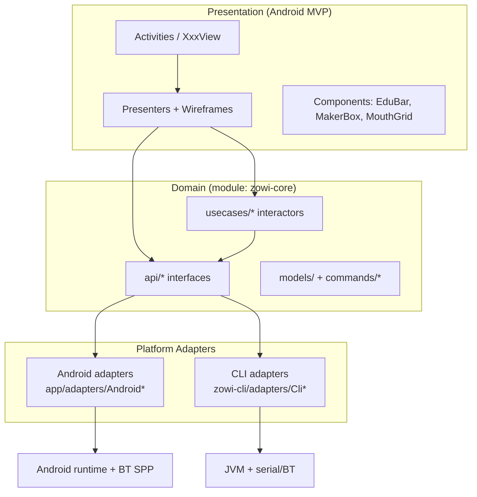
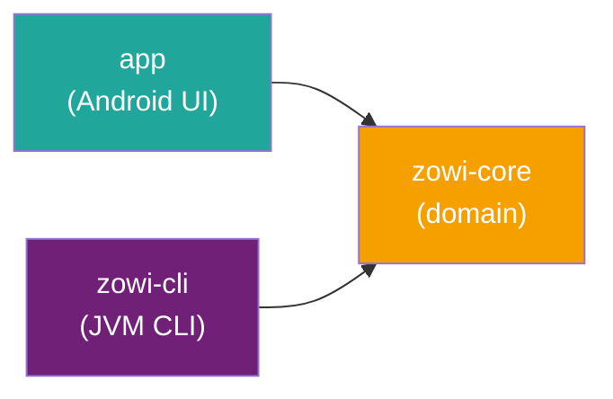
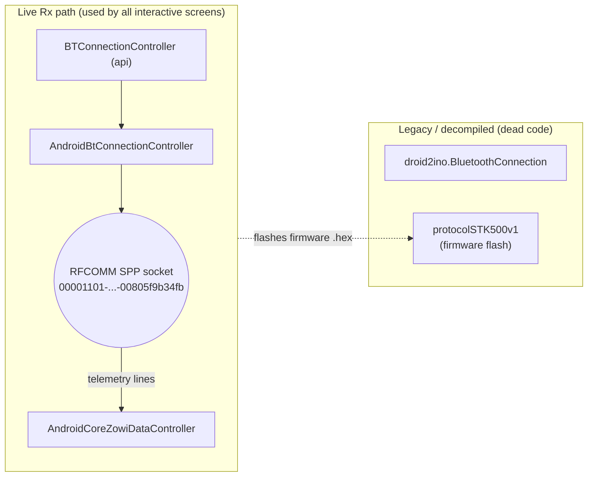

# ZowiAppReborn — Architecture

> Scope: source as of `HEAD` (`1.9.2.1`, `versionCode` 583) plus logic recovered from the
> initial decompiled commit `97ea8b8` (see `IMPLEMENTATION.md` §Recovered Logic and `docs/project/NO_ANALYTICS.md`).
> Companion documents: `IMPLEMENTATION.md` (behavioral logic + manual verification checklist),
> `DESIGN.md` (visual identity & graphic resources).

## Table of Contents

- [1. System Overview](#1-system-overview)
- [2. High-Level Layered Architecture](#2-high-level-layered-architecture)
  - [2.1 Architecture Diagram (Mermaid)](#21-architecture-diagram-mermaid)
- [3. Modules](#3-modules)
  - [3.1 Module Dependency Diagram](#31-module-dependency-diagram)
- [4. Presentation Layer (Android MVP)](#4-presentation-layer-android-mvp)
  - [4.1 Triples (View / Presenter / Wireframe)](#41-triples-view-presenter-wireframe)
  - [4.2 Activities (declared in `AndroidManifest.xml`)](#42-activities-declared-in-androidmanifestxml)
  - [4.3 Custom UI Components (`components/`)](#43-custom-ui-components-components)
- [5. Domain Layer (`zowi-core`)](#5-domain-layer-zowi-core)
  - [5.1 API interfaces (`api/`) — platform-agnostic contracts](#51-api-interfaces-api-platform-agnostic-contracts)
  - [5.2 UseCases (`usecases/`) — interface + `*Impl`, RxJava2 return types](#52-usecases-usecases-interface-impl-rxjava2-return-types)
  - [5.3 Models (`models/`)](#53-models-models)
- [6. Platform Adapters](#6-platform-adapters)
- [7. Cross-Cutting Concerns](#7-cross-cutting-concerns)
- [8. Bluetooth Communication Architecture](#8-bluetooth-communication-architecture)
  - [8.1 Bluetooth Architecture Diagram](#81-bluetooth-architecture-diagram)
- [9. Data & Assets (app module)](#9-data-assets-app-module)
- [10. Build & Tooling](#10-build-tooling)
- [11. References](#11-references)

## 1. System Overview

**ZowiAppReborn** is the modernized rebirth of the original 2016 BQ Android app that lets
children (primary/secondary education) drive and program the **Zowi** robot.

- **Robot hardware:** Zowi is built around an **ATmega** board (the app/firmware side talks to it
  as a serial device) with an **HC-05/HC-06 Bluetooth Classic (SPP/RFCOMM)** module.
  The Bluetooth SPP UUID is `00001101-0000-1000-8000-00805f9b34fb`. **BLE is not supported**
  (see `docs/project/MIGRATING.md`).
- **Communication model:** text command/response over an RFCOMM socket, terminated by `\r\n`
  (`Command.CRLN`). The robot echoes telemetry tokens (`N` name, `U` app id, `B` battery,
  `D` distance, `I` noise).
- **Two front-ends, one core:** the same business logic powers both the Android app and a
  JVM command-line tool (`zowi-cli`), via a shared Kotlin domain module (`zowi-core`) and
  platform-specific adapters.

## 2. High-Level Layered Architecture

```
┌──────────────────────────────────────────────────────────────────────┐
│                          PRESENTATION (Android)                       │
│   Activities (View)  ──implements──▶  XxxView  contracts              │
│   Presenters (MVP)   ──holds logic──▶  XxxPresenter / XxxPresenterImpl│
│   Wireframes (nav)   ──routes to─────▶  XxxWireframe / XxxWireframeImpl│
│   Components (UI)    ──EduBar, QuizView, GifView, MouthGrid, MakerBox… │
└───────────────────────────────┬──────────────────────────────────────┘
                                 │ injected use-cases & controllers
┌───────────────────────────────┴──────────────────────────────────────┐
│                       DOMAIN LAYER  (module: zowi-core)               │
│   api/*        platform-agnostic interfaces (BT, Session, Game, …)    │
│   usecases/*   interactors (interface + *Impl), RxJava2 return types  │
│   models/*     domain models + command protocol (commands/*)          │
│   rx/, utils/  RetryWithDelay, Grove logger                           │
└───────────────────────────────┬──────────────────────────────────────┘
                                 │ implemented per platform
        ┌────────────────────────┴─────────────────────────┐
        ▼                                                  ▼
┌────────────────────────────┐                ┌────────────────────────────┐
│  ANDROID ADAPTERS          │                │  CLI ADAPTERS              │
│  app/adapters/Android*     │                │  zowi-cli/adapters/Cli*    │
│  Bluetooth SPP, SharedPreferences,         │  jSerialComm / BT, JSON     │
│  AssetManager, Android schedulers          │  key/value store, console   │
└────────────────────────────┘                └────────────────────────────┘
        │                                                  │
        ▼                                                  ▼
   Android runtime (Activities, BT, UI)          JVM (terminal / serial port)
```

**Pattern:** **MVP + a Clean-ish UseCase layer + platform abstraction via interfaces.**
Views never touch the domain directly; Presenters call injected `zowi-core` use-cases and
controllers. Navigation is centralized in Wireframes. Dependency wiring is centralized in a
singleton `AndroidDependencyInjector`.

### 2.1 Architecture Diagram (Mermaid)



## 3. Modules

| Module | `build.gradle` type | Namespace / mainClass | Role |
|---|---|---|---|
| **app** | `com.android.application` | `com.bq.zowi` (appId `com.bq.zowi`) | Android UI + MVP + Android adapters. `minSdk 21`, `targetSdk 34`, `compileSdk 34`, Java/Kotlin 11. Depends on `:zowi-core`, AndroidX, Material, Gson, Retrofit 1.9, Bugsnag, RxJava 1 & 2. |
| **zowi-core** | `java-library` + `kotlin.jvm` | `com.bq.zowi` (Kotlin) | Platform-agnostic domain: `api/` interfaces, `usecases/`, `models/`. Depends on RxJava2, Gson. Has JUnit + Mockito unit tests. Contains an (empty) `protocol/` placeholder package. |
| **zowi-cli** | `application` + `kotlin.jvm` | `com.bq.zowi.cli.ZowiCliKt` | Standalone JVM CLI to drive the robot over serial/BT without Android. Depends on `:zowi-core`, `jSerialComm`, Gson, RxJava2. |

Root build: AGP `8.6.0`, Kotlin `1.9.24`. Declared in `settings.gradle` (`rootProject.name = 'Zowi App'`).

### 3.1 Module Dependency Diagram



## 4. Presentation Layer (Android MVP)

### 4.1 Triples (View / Presenter / Wireframe)
Every screen is implemented as a `XxxView` interface + `XxxPresenter`(+`Impl`) + `XxxWireframe`(+`Impl`).
Base classes: `BasePresenter<V,W>`, `BasePresenterImpl`, `InteractiveBasePresenter(Impl)`,
`BaseActivity`, `InteractiveBaseActivity`, `BaseFragment` (unused), `InteractiveBaseView`.

### 4.2 Activities (declared in `AndroidManifest.xml`)
All 16 activities are `screenOrientation="landscape"`; `SplashViewActivity` is `LAUNCHER`.
No `<service>`, `<receiver>`, or `<provider>` is declared in the manifest
(`BaseBluetoothConnectionActivity` defines an inner `DisconnectBluetoothBroadcastReceiver`,
not manifest-registered).

| Activity | Package | Purpose |
|---|---|---|
| `ZowiApplication` | `com.bq.zowi` | `Application`; initializes `AndroidDependencyInjector` singleton. |
| `SplashViewActivity` | `views.splash` | Launcher; ~1.5 s timer → routes to Home (active session) or Welcome. |
| `WelcomeViewActivity` | `views.welcome` | Onboarding / "Start Wizard" entry. |
| `WizardViewActivity` | `views.wizard` | Bluetooth pairing wizard (search → found → connect → name). |
| `HomeViewActivity` | `views.interactive.home` | Hub: apps / games / projects grid; Mouths-Editor unlock state. |
| `PadViewActivity` | `views.interactive.pad` | Gamepad / action-pad controller. |
| `TimelineActivity` | `views.interactive.timeline` | Drag-and-drop command-sequence editor ("program Zowi"). |
| `AchievementsViewActivity` | `views.interactive.achievements` | Achievement gallery + ranking. |
| `SettingsViewActivity` | `views.interactive.settings` | Rename Zowi, forget Zowi, forget history, restore firmware. |
| `CalibrationViewActivity` | `views.interactive.settings` | Legs/feet calibration. |
| `MouthsEditorActivity` | `views.interactive.zowiapps` | LED-mouth matrix editor. |
| `MouthsMinigameActivity` | `views.interactive.zowiapps.minigames` | Mouths matching minigame. |
| `ZowiSaysMinigameActivity` | `views.interactive.zowiapps.minigames` | "Simon says" minigame. |
| `ZowiRunnerMinigameActivity` | `views.interactive.zowiapps.minigames` | Runner / dodge minigame. |
| `ProjectViewActivity` | `views.interactive.projects` | Project detail + firmware/hex flash (reused for 10 projects via `project_id_extra`). |
| `ProjectQuizViewActivity` | `views.interactive.projects` | Project quiz / "Run Test". |

### 4.3 Custom UI Components (`components/`)
`EduBar` (top status strip: connection / battery / firmware / achievements), `QuizView`,
`GifView` (legacy, see `DESIGN.md`), `MouthGridLayout` / `MouthGridItemView`, `CommandTileView`,
`makerboxdialogs/*` (MakerBox modal framework), `recyclerview/*`, `games/*`, `home/*`,
`timeline/*`. Vendored third-party `com.h6ah4i.android.widget.advrecyclerview` supports the
timeline drag-and-drop.

## 5. Domain Layer (`zowi-core`)

### 5.1 API interfaces (`api/`) — platform-agnostic contracts
| Interface | Responsibility |
|---|---|
| `BTConnectionController` | Open/close RFCOMM socket, send messages, expose connection-status & received-message observables. |
| `BTAdapterController` | Enable/disable BT, start/stop discovery → `Observable<DeviceHandle>`. |
| `DeviceHandle` | Abstraction over a remote BT device (address/name). |
| `SessionController` | Persist active Zowi address/name + wizard-dismissed flag. |
| `AppController` | First-use / days-of-use tracking, app-started logging. |
| `GameController` | Per-game progress load/save/reset; `GAME_ID` enum. |
| `AchievementsController` | Get/unlock/list achievements, reset. |
| `ProjectController` | Load project, mark completed, block/unblock quiz. |
| `RankingController` | Get/save rankings, top-10 check, reset. |
| `AssetController` / `AssetProvider` | Load bundled assets (projects, achievements, firmware). |
| `ZowiDataController` | Robot telemetry cache/parser (battery, distance, noise, app id, name). |
| `KitonNetworkController` | Backend "is-alive" ping (MakerBox ranking/projects server). |
| `KeyValueStore` | Typed persistence abstraction. |
| `Logger` | Logging facade (implemented by `Grove`). |

### 5.2 UseCases (`usecases/`) — interface + `*Impl`, RxJava2 return types
| Interactor | Returns | Responsibility |
|---|---|---|
| `SendCommandToZowiInteractor` | `Single<Void>` | Serialize a `Command` and write it to the BT socket. |
| `ConnectToZowiInteractor` | `Single<Void>` | Connect to a device address (duplex flag). |
| `FindZowisInteractor` | `Single<DeviceHandle>` (initial) / discovery observable | Discover Zowi robots. |
| `ChangeZowiNameInteractor` | `Single<Void>` | Send `SET_NAME` + persist. |
| `MeasureZowiBatteryLevelInteractor` | `Single<Float>` | Request & read battery telemetry. |
| `ForgetZowiInteractor` | `Single<Void>` | Clear active-Zowi session. |
| `ForgetPlayingHistoryInteractor` | `Single<Void>` | Clear achievements/ranking/game progress. |
| `SendAppToZowiInteractor` | `Observable<Integer>` | Stream a firmware `.hex` to the robot (progress). |
| `CheckAchievementAndUnlockItInteractor` | `Single<Achievement>` | Evaluate + unlock an achievement by id. |
| `CheckInstalledZowiAppInteractor` | `Single<Boolean>` | Detect which firmware/app is flashed. |

### 5.3 Models (`models/`)
Domain models: `Achievement`, `Project`, `RankingEntry`, `ZowiName`, `ConnectionSuccessData`,
`networkModels/KitonIsAliveResponseNetworkModel`. The **command protocol** lives in
`models/commands/` — see `IMPLEMENTATION.md` §Command & Protocol Model.

## 6. Platform Adapters

- **Android (`app/adapters/`):** `AndroidBtConnectionController`, `AndroidBtAdapterController`,
  `AndroidCoreSessionController`, `AndroidCoreAppController`, `AndroidCoreGameController`,
  `AndroidCoreAchievementsController`, `AndroidCoreProjectController`, `AndroidCoreRankingController`,
  `AndroidCoreZowiDataController`, `AndroidCoreKitonNetworkController`, `AndroidCoreAssetController`,
  `AndroidAssetProvider`, `AndroidKeyValueStore` (SharedPreferences), `CoreAdapterProvider` +
  `CoreInteractorProvider` (lazy factories bridging Android ↔ `zowi-core`).
- **CLI (`zowi-cli/adapters/`):** `Cli*` equivalents (`CliBtConnectionController`,
  `CliBtAdapterController`, `CliSessionController`, …) + `ConsoleLogger`.
- **CLI storage:** `JsonKeyValueStore`, `FileAssetProvider`.

## 7. Cross-Cutting Concerns

- **Dependency Injection:** `AndroidDependencyInjector` (singleton `getInstance()`) → `init()`
  builds `CoreAdapterProvider` + `CoreInteractorProvider`. `injector/DependencyInjector` is the
  abstract base. (Initial commit also had a `DependencyCache`; removed.)
- **Reactive:** RxJava2 (`Single`/`Observable`/`Completable`) threads domain ops;
  `provideUiScheduler()` = `AndroidSchedulers.mainThread()`. `RetryWithDelay` is the shared retry operator.
- **Logging:** `Grove` facade (in `app/utils` and `zowi-core/utils`).
- **Error reporting:** `CustomErrorReporter` → `BugsnagCustomErrorReporter` (Bugsnag SDK dependency;
  Adobe/comScore/BQ analytics were fully removed — `docs/project/NO_ANALYTICS.md`).
- **Persistence:** `KeyValueStore` → Android `SharedPreferences` / CLI JSON file.

## 8. Bluetooth Communication Architecture

**Live path (Rx-based, used by all interactive presenters):**
`zowi-core/api/BTConnectionController.kt` → `app/adapters/AndroidBtConnectionController.kt`.
`connect(DeviceHandle, duplex)` opens an RFCOMM `BluetoothSocket` at `SPP_UUID`; `sendMessage(String)`
writes bytes; a daemon thread (`zowi-bt-reader`) parses incoming lines split on `\r\n` into a
`PublishSubject<String>`. State and received messages are exposed as Rx observables
(`getConnectionStatusObservable`, `getReceivedMessageObservable`).
Telemetry is parsed in `AndroidCoreZowiDataController` (tokens `N/U/B/D/I` → `BehaviorSubject`s).

**Legacy path (present but effectively dead code):** `com/bq/robotic/droid2ino/BluetoothConnection.java`
(thread/Handler-based `AcceptThread`/`ConnectThread`/`ConnectedThread`) and `protocolSTK500v1/*`
(STK500v1 firmware programmer: `STK500v1`, `Hex`, `Reader`) are leftovers from the decompiled APK,
no longer referenced by app code. They remain as the firmware-flash surface and regression baseline
(see `docs/project/bluetooth-regression-checklist.md`, `ZOWI_ROBOTICS.md`).

### 8.1 Bluetooth Architecture Diagram



## 9. Data & Assets (app module)

- `assets/projects/01_project_mueve.json` … `10_project_gravity.json` — 10 Discover lessons.
- `assets/achievements/initial_list.json` — achievement catalog.
- `assets/ZOWI_BASE_v2.hex`, `ZOWI_Alarm_v2.hex`, `ZOWI_Adivinawi_v2.hex` — firmware images flashed via STK500v1.
- `assets/app_config.properties` — externalized URLs (Hospital, Play Store, backend) loaded at runtime.

## 10. Build & Tooling

- `run_app.sh` — build, install, and launch on a connected device/emulator.
- `run_emulator.sh` — launch emulator with Spanish locale, landscape, `UI_DENSITY=350`, `FONT_SCALE=1.0`.
- `.github/copilot-instructions.md` — build/architecture/validation guidance.
- Unit tests: `zowi-core` (JUnit+Mockito), `zowi-cli` (JUnit+Mockito, incl. `Cli*Test`).

## 11. References

- `IMPLEMENTATION.md` — behavioral logic, command vocabulary, recovered initial-commit logic, manual verification checklist.
- `DESIGN.md` — visual identity, themes, drawables, layouts, animations, LED-mouth rendering.
- `docs/project/VIEWS.md` — MVP architecture, full navigation tree (27 routes, 10 project variants), and per-screen actuation logic.
- `docs/project/NO_ANALYTICS.md`, `MIGRATING.md`, `bluetooth-regression-checklist.md`, `ACHIEVEMENTS.md`, `ZOWI_CLI_ANDROID_HOWTO.md`, `ZOWI_ROBOTICS.md`, `PLANNING.md`.
