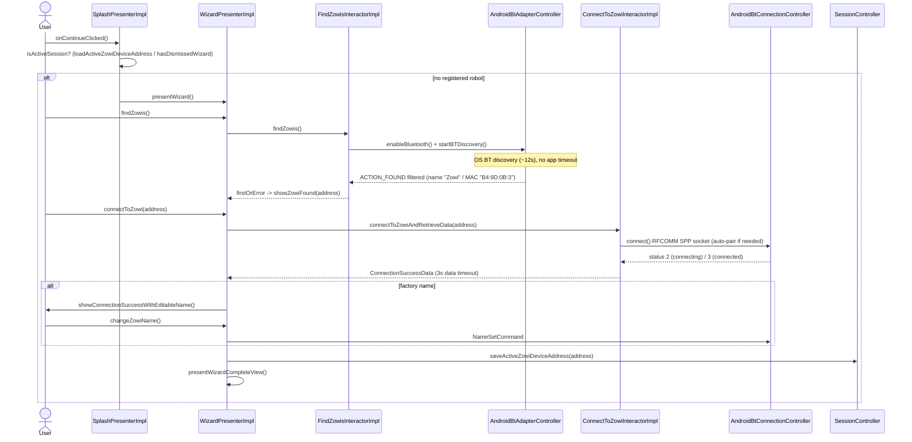
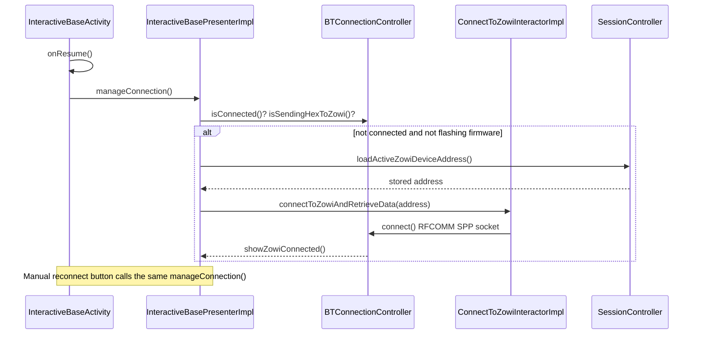
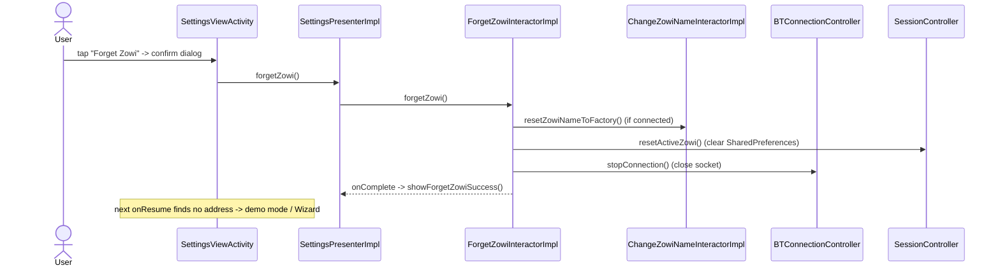

# Connection Management

This document describes the full Bluetooth connection lifecycle of the Android app,
ordered chronologically:

1. **App entry** — the Splash decides whether a robot is already registered or a new one
   must be paired (Wizard).
2. **Pairing a new robot** — discovery, connection and naming via the Wizard.
3. **Connecting to a previously registered robot** — automatic on screen resume and via
   the manual reconnect button.
4. **Disconnection & "Forget Zowi"** — tearing down the connection and clearing the
   stored robot.

The low-level connection itself is the same in every case: a Bluetooth Classic **SPP**
socket (`AndroidBtConnectionController`, UUID `00001101-0000-1000-8000-00805f9b34fb`,
`app/src/main/java/com/bq/zowi/adapters/AndroidBtConnectionController.kt:24`). There is no
explicit `createBond()` call; if the OS has no prior bond, Android negotiates the pairing
automatically during the RFCOMM `connect()`.

---

## 1. App entry — the Splash decision

`SplashPresenterImpl.onContinueClicked()`
(`app/src/main/java/com/bq/zowi/presenters/splash/SplashPresenterImpl.java:21`) computes:

```java
boolean isActiveSession =
    this.sessionController.loadActiveZowiDeviceAddress() != null
    || this.sessionController.hasDismissedWizard();
```

- If `isActiveSession` is **true** (a robot address is stored, or the wizard was
  previously dismissed), it navigates to `HomeViewActivity` — an interactive screen that
  tries to connect immediately (see §3).
- If **false** (no robot has ever been registered), it launches the **Wizard** to pair a
  new robot (see §2).

---

## 2. Pairing a new robot (Wizard flow)

The Wizard is driven by `WizardPresenterImpl`
(`app/src/main/java/com/bq/zowi/presenters/wizard/WizardPresenterImpl.java`) and
`WizardViewActivity`
(`app/src/main/java/com/bq/zowi/views/wizard/WizardViewActivity.java`). It is only used
when no robot is registered yet.

### 2.1 Discovery (`findZowis`)

`WizardPresenterImpl.findZowis()` (`:33`) delegates to
`FindZowisInteractorImpl.findZowis()`
(`zowi-core/src/main/kotlin/com/bq/zowi/usecases/FindZowisInteractorImpl.kt:12`), which:

1. Enables Bluetooth (`BTAdapterController.enableBluetooth()`).
2. Starts discovery (`BTAdapterController.startBTDiscovery()`).
3. Filters discovered devices: a device is considered a Zowi if its **name starts with
   `"Zowi"`** or its **MAC address starts with `"B4:9D:0B:3"`**
   (`FindZowisInteractorImpl.kt:20-22`).
4. Emits the **first** match via `.firstOrError()`.

The discovery itself is implemented in `AndroidBtAdapterController.startBTDiscovery()`
(`app/src/main/java/com/bq/zowi/adapters/AndroidBtAdapterController.kt:38`) using a
`BroadcastReceiver` for `BluetoothDevice.ACTION_FOUND`. It completes only when
`BluetoothAdapter.ACTION_DISCOVERY_FINISHED` is received.

> **Timeout analysis:** there is **no application-level timeout** on discovery. The
> `Observable` has no `.timeout(...)` operator, so the only limit is Android's own BT
> discovery window (≈ 12 s by default at the OS level). When discovery finishes without a
> matching device, the `Observable` completes empty and `.firstOrError()` emits an error,
> which the presenter surfaces as `showNoZowisFound()`. Note that a *different* 3-second
> timeout does exist — but only for receiving robot data **after** a connection succeeds
> (see §2.2).

### 2.2 Connection & pairing (`connectToZowi`)

Once a device is found, `WizardPresenterImpl.connectToZowi(address)` (`:46`) calls
`ConnectToZowiInteractorImpl.connectToZowiAndRetrieveData(address)`
(`zowi-core/src/main/kotlin/com/bq/zowi/usecases/ConnectToZowiInteractorImpl.kt:23`):

- It connects through `BTConnectionController.connect()`, which opens the RFCOMM SPP
  socket (`AndroidBtConnectionController.connect()`,
  `app/src/main/java/com/bq/zowi/adapters/AndroidBtConnectionController.kt:35`).
- It retries the connection with `RetryWithDelay(3, 1000)` and, as a last resort, one
  disable/re-enable cycle of Bluetooth
  (`ConnectToZowiInteractorImpl.kt:56-68`).
- It then waits (via `Single.zip`) for the robot name, app id and battery level, applying
  a **3-second timeout**: `.timeout(3000L, TimeUnit.MILLISECONDS, Single.just(null))`
  (`ConnectToZowiInteractorImpl.kt:32`). On timeout it proceeds with `null` data.

Because the connection goes through `createRfcommSocketToServiceRecord(...).connect()`,
the OS performs the Bluetooth Classic pairing automatically if the devices are not already
bonded (no manual PIN handling in the app).

### 2.3 Naming & completing the wizard

On success, `WizardPresenterImpl.manageZowiConnectionSuccess()` (`:91`):

- If the robot still has a **factory name**, it shows an editable-name screen
  (`showConnectionSuccessWithEditableName`) and waits for the user to call
  `changeZowiName()` (`:59`), which sends a `NameSetCommand` and saves the chosen name.
- Otherwise it saves the name received from the robot.
- Either path ends in `wizardComplete(address)` (`:80`), which persists the device address
  via `sessionController.saveActiveZowiDeviceAddress(address)` and navigates to the
  completion screen.

### 2.4 Sequence diagram



---

## 3. Connecting to a previously registered robot

After a robot's address is stored, the app reconnects to it automatically whenever an
interactive screen resumes, and manually via the reconnect button. This is the "registered
robot" path (as opposed to the Wizard's fresh-address path).

The connection logic lives in `InteractiveBasePresenterImpl.connectToZowi()`
(`app/src/main/java/com/bq/zowi/presenters/interactive/InteractiveBasePresenterImpl.java:179`),
which reads `sessionController.loadActiveZowiDeviceAddress()` and calls
`connectToZowiInteractor.connectToZowiAndRetrieveData(activeZowiAddress)`.

### 3.1 On resume of any interactive screen (`onResume`)

`InteractiveBaseActivity.onResume()`
(`app/src/main/java/com/bq/zowi/views/interactive/InteractiveBaseActivity.java:453`)
calls `getPresenter().manageConnection()`.

`InteractiveBasePresenterImpl.manageConnection()`
(`InteractiveBasePresenterImpl.java:48`) connects only when the robot is **not already
connected** and firmware is **not being flashed**, invoking `connectToZowi()`.

This fires every time one of the **11 activities** that extend `InteractiveBaseActivity`
returns to the foreground:

- `HomeViewActivity`
- `PadViewActivity`
- `TimelineActivity`
- `SettingsViewActivity`
- `CalibrationViewActivity`
- `AchievementsViewActivity`
- `ProjectViewActivity`
- `ProjectQuizViewActivity`
- `MouthsEditorActivity`
- `ZowiRunnerMinigameActivity`
- `MinigameBaseActivity` (base class for the ZowiSays / Mouths minigames)

### 3.2 Manual reconnect button in the status bar

The `zowiConnectButton` in the connection header
(`InteractiveBaseActivity.java:161`) sets `isConnecting = true` and calls
`manageConnection()`, following the same connection path as §3.1.

### 3.3 Sequence diagram



---

## 4. Disconnection & "Forget Zowi"

### 4.1 Disconnection (`stopConnection`)

`BTConnectionController.stopConnection()`
(`app/src/main/java/com/bq/zowi/adapters/AndroidBtConnectionController.kt:106`):

- Interrupts the reader thread.
- Closes the `BluetoothSocket`.
- Sets `connected = false` and emits connection status `0` (disconnected).

It is also wrapped by `ConnectToZowiInteractorImpl.disconnectFromZowi()`
(`zowi-core/src/main/kotlin/com/bq/zowi/usecases/ConnectToZowiInteractorImpl.kt:72`),
which waits 1 s after closing the socket.

> **No automatic reconnection.** The connection-status listener in
> `InteractiveBasePresenterImpl` (`InteractiveBasePresenterImpl.java:154`) only updates the
> UI (shows "demo mode" or "disconnected"); it does **not** re-attempt a connection. A new
> connection only happens on the next `onResume` / manual button press (§3), or after the
> robot is re-registered.

### 4.2 "Forget Zowi" (unregister the robot)

Triggered from `SettingsViewActivity`, which shows a confirmation dialog
(`forgetZowiDialog`); on confirm it calls `SettingsPresenterImpl.forgetZowi()`
(`app/src/main/java/com/bq/zowi/presenters/interactive/settings/SettingsPresenterImpl.java:81`)
→ `ForgetZowiInteractorImpl.forgetZowi()`
(`zowi-core/src/main/kotlin/com/bq/zowi/usecases/ForgetZowiInteractorImpl.kt:13`):

1. `changeZowiNameInteractor.resetZowiNameToFactory()` — sends the factory-name command to
   the robot (only meaningful if still connected).
2. `sessionController.resetActiveZowi()` — removes `activeZowiDeviceAddress` and
   `activeZowiName` from `SharedPreferences`
   (`app/src/main/java/com/bq/zowi/adapters/AndroidCoreSessionController.kt:36`).
3. `connectionController.stopConnection()` — closes the socket (see §4.1).

On completion the view shows `showForgetZowiSuccess()` (a toast); the next `onResume` finds
no stored address and falls back to demo mode / the Wizard.

### 4.3 Sequence diagram



---

## Important notes

- **No automatic reconnection after a disconnect.** The connection-status listener only
  updates the UI; reconnection happens only on `onResume`, the manual button, or after
  re-registration.
- **The Wizard uses a freshly discovered address, not the persisted one.** It is mutually
  exclusive with §3: the Wizard runs only when no robot is registered.
- **Discovery has no app-level timeout** (≈ 12 s OS window). The 3-second timeout in
  `ConnectToZowiInteractorImpl.kt:32` applies only to receiving robot data *after* a
  successful connection, in both the Wizard and the registered-robot paths.
