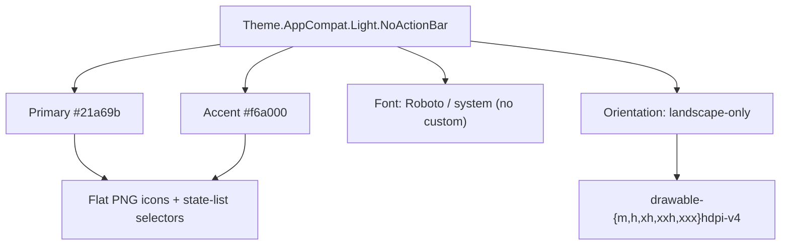
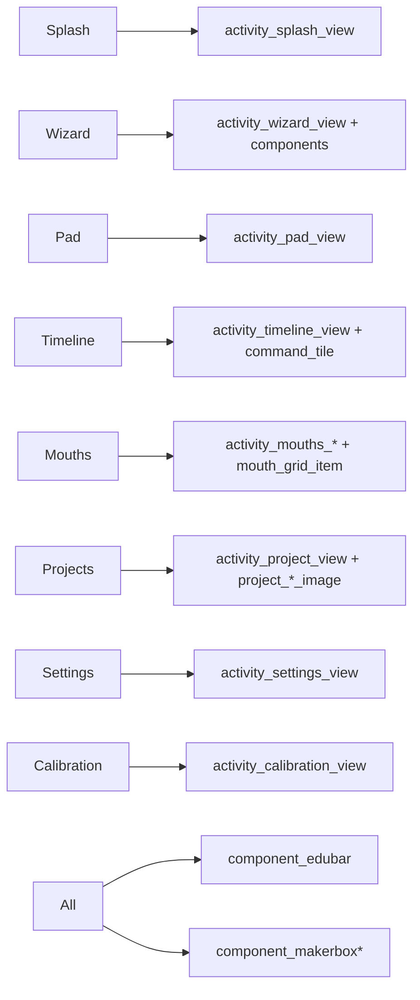

# ZowiAppReborn — Design (Aesthetics & Graphic Resources)

> Companion to `ARCHITECTURE.md` (layers/components) and `IMPLEMENTATION.md` (logic/verification).
> This document inventories the app's visual identity and the graphic resources that implement it,
> based on `app/src/main/res/` and `AndroidManifest.xml`.

## Table of Contents

- [1. Visual Identity at a Glance](#1-visual-identity-at-a-glance)
  - [1.1 Visual System Diagram](#11-visual-system-diagram)
- [2. Color Palette (`res/values/colors.xml`)](#2-color-palette-resvaluescolorsxml)
- [3. Typography & Dimensions](#3-typography-dimensions)
- [4. Layout Inventory (per screen)](#4-layout-inventory-per-screen)
- [5. Drawable / Iconography Inventory](#5-drawable-iconography-inventory)
- [6. Animations (`res/anim/`)](#6-animations-resanim)
- [7. LED Mouth Rendering](#7-led-mouth-rendering)
- [8. EduBar & MakerBox Dialogs](#8-edubar-makerbox-dialogs)
- [9. Responsiveness Summary](#9-responsiveness-summary)
  - [9.1 Screen → Resource Map](#91-screen-resource-map)
- [10. Resource Organization Conventions](#10-resource-organization-conventions)

## 1. Visual Identity at a Glance

- **Orientation:** landscape-only (all 16 activities declare `android:screenOrientation="landscape"`).
- **Theme family:** **AppCompat** — `Theme.AppCompat.Light.NoActionBar` (`AppTheme`), plus a
  secondary `Theme.IAPTheme` (in-app purchase) extending `Theme.AppCompat.Light`. No `themes.xml`
  and no night/theme-variant resources exist.
- **Brand palette:** teal-green primary + orange-yellow accent (Material-AppCompat lineage).
- **Iconography:** flat raster PNGs in 5 density buckets + XML state-list selectors; **no vector
  drawables, no icon font**.
- **Typography:** stock system font (Roboto) via AppCompat — **no custom font** (`res/font/` absent,
  no `.ttf`/`.otf` in `assets/`).
- **LED mouth:** drawn **programmatically** as a 6×5 grid (not per-glyph bitmaps).

### 1.1 Visual System Diagram

## 2. Color Palette (`res/values/colors.xml`)

| Role | Name | Hex |
|---|---|---|
| Primary | `primary` | `#21a69b` |
| Primary dark | `primary_dark` | `#17736c` |
| Accent | `accent` | `#f6a000` |
| Accent dark | `yellow_dark` | `#ab6f00` |
| Positive | `green` / `green_dark` | green / darker green |
| Negative | `red` / `red_dark` | `#eb0028` / darker red |
| Brand purple | `purple` | `#702076` |
| Neutrals | `gray_dark` / `gray_medium` / `gray_light` | `#4d4d4f` / `#a6a8ab` / `#cdcdc9` |
| EduBar text | `edubar_text_color` | `#005e58` |
| Snackbar bg | `snackbar_background_color` | `#323232` |

**Zowi Says minigame sub-palette:** `zowi_says_green #21a69b`, `zowi_says_pink #d60056`,
`zowi_says_purple #702076`, `zowi_says_red #eb0028`, `zowi_says_yellow #ffe000` (each with an
`_inner_shadow` variant for the pressed/active state).

The file also redefines AppCompat/Material internal colors (`material_deep_teal_500 #009688`,
`accent_material_light`, …), confirming the Material-AppCompat heritage.

## 3. Typography & Dimensions

- No custom typeface; sizes live in `dimens.xml` (e.g. `edubar_message_text_size` /
  `edubar_action_text_size` = `14sp`; `maker_box_dialog_button_text_size`; `progress_bar_text_size`).
- Font scale is **not** a resource; `run_emulator.sh` forces `FONT_SCALE=1.0` at runtime.
- UI sizing for tablets is driven by `values-land/`, `values-sw600dp-v13/`, `values-h720dp-v13/`,
  `values-w{360,480,500,600,720}dp-v13/`, `values-sw720dp(-land)-v13/`, `values-large/`,
  `values-xlarge(-land)/` carrying `bools.xml`, `dimens.xml`, `styles.xml` (and some
  `colors/strings/integers/drawables`) to rescale gamepad/calibration/EduBar elements.

## 4. Layout Inventory (per screen)

`res/layout/` (with `layout-sw600dp-v13/` and `layout-sw600dp-v21/` tablet overrides).

| Screen | Layout(s) |
|---|---|
| Splash | `activity_splash_view.xml` (`diagram_splash`) |
| Welcome | `activity_welcome_view.xml` (`welcome_image`) |
| Wizard | `activity_wizard_view.xml`, `component_wizard_connected`, `component_wizard_welcome`, `component_wizard_searching`, `component_wizard_zowi_found` (`wizard_selected_zowi_animation`) |
| Home | `activity_home_view.xml`, `component_home_games`, `component_home_projects`, `command_tile_view`, `component_command_tile_view` |
| Pad | `activity_pad_view.xml` (+ `layout-sw600dp-v13` override), `pad_background` |
| Timeline | `activity_timeline_view.xml`, `timeline_selected_command_row_view`, `command_tile_view`, `component_selected_command_row_view`, `menu/timeline_selected_item_menu.xml` |
| Mouths | `activity_mouths_editor_view.xml`, `activity_mouths_minigame_view.xml`, `mouth_grid_item.xml` |
| Minigames / Quiz | `activity_zowi_says_minigame_view.xml`, `activity_zowi_runner_minigame_view.xml`, `activity_project_quiz_view.xml`, `component_quiz_view`, `quiz_question_view`, `quiz_answer_row_view` (`answer_check`) |
| Projects | `activity_project_view.xml`, `component_project_content` (+ sw600dp overrides) |
| Achievements | `activity_achievements_view.xml`, `achievement_row_view`, `ranking_entry_row_view` |
| Settings | `activity_settings_view.xml` (`settings_*`, `search_for_updates_button`, `calibrate_zowi`, `forget_zowi`, `rename`, `hospital`, `factory_reset`, `remove_achievements`) |
| Calibration | `activity_calibration_view.xml`, `component_calibration_check/feet/legs/warning` |
| Dialogs / MakerBox | `component_makerbox`, `component_makerbox_{achievement,failure,points_earned_enable_ranking,ranking,scrollable,success}`, `component_notification` (hosts all `MakerBoxDialog`s), `design_navigation_item{,_header,_separator,_subheader}`, `select_dialog_*_material`, `support_simple_spinner_dropdown_item`, `device_list`, `device_name`, `notification_media_action` |
| Shared components | `component_edubar`, `component_zowi_app`, `layout_snackbar`, `layout_snackbar_include` |

## 5. Drawable / Iconography Inventory

Organized as **XML state-list selectors + shape drawables** in `res/drawable/` and **raster PNGs**
in density buckets `drawable-{hdpi,mdpi,xhdpi,xxhdpi,xxxhdpi}-v4` (~375–377 PNGs each),
plus `drawable-nodpi-v4` (9-patch shadows) and `drawable-sw600dp-v13` (one shape).

- **Gamepad/Pad buttons:** `pad_walk_forward/backward`, `pad_turn_left/right`, `pad_updown`,
  `pad_bend/crusaito/flapping/jitter/swing`, `pad_moonwalker_left/right`, `pad_shake_leg`,
  `pad_speed_fast/medium/slow`, `direction_front/back/left/right`, `pad_button`, plus greyed
  `blocked_pad_*` variants (achievement-locked states).
- **Movement / Home-tile command icons:** `walk/turn/updown/moonwalker/swing/crusaito/flapping/
  tip_toe/bend/shake_leg/jitter/ascending_turn` (+ `*_icon` / `*_badge`), `move1..move4`,
  `moves_button`, `eyes_button`, `feet_button`, `timeline_*` (per-command small icons).
- **Mouth / LED glyph icons:** `smile`, `sad/sad_open/sad_closed`, `happy_open`, `confused`,
  `big_surprise`, `small_surprise`, `heart`, `thunder`, `x_mouth`, `interrogation`, `tongue_out`,
  `diagonal`, `angry`, `culito`, `ok_mouth`, `line_mouth`, `vamp1/vamp2` (each with `*_button`,
  `*_icon`, `pressed_*` states), `mouths_led_on.png` / `mouths_led_off.png`, `mouths_editor_badge`,
  `mouths_game_button`, `mouths_editor_game_button`, `mouths_help_image`.
- **Emotion / animation faces:** `animation_happy/super_happy/sad/confused/sleepy/fart/angry/
  anxious/magic/in_love/wave` (+ `pressed_*` + `*_badge` achievement badges).
- **EduBar / status / connection (branding):** `zowi_connected_icon`, `zowi_disconnected_icon`,
  `zowi_low_battery_icon`, `zowi_altered_icon`, `zowi_demo_icon`, `zowi_logo`, `zowi_found_image`,
  `zowi_not_found_image`, `search_icon`, `log_in_icon`, `restore_icon`.
- **Wizard/Welcome/Splash:** `welcome_image`, `diagram_splash`, `zowi_found_image`, `zowi_not_found_image`.
- **Calibration:** `calibrate_zowi_button`, `calibrate_legs_image`, `calibrate_feet_image`,
  `calibrate_standing_image`, `forget_zowi_button`, `plus_zowi_button`, `less_zowi_button`,
  `robot_form_button`.
- **Projects / Home tiles:** `project_*_image` (mueve, choreography, forma, bio1/bio3, reprogram,
  helloworld, bitbloq2, adivinawi, gravity, paint, disassemble, alarm, eyes, move), `project_done_icon` /
  `project_not_done_icon`, plus project launch buttons (`simon_game`, `adivinawi`, `paint`, `choreography`,
  `gravity`, `bitbloq(2)`, `disassemble`).
- **Achievements / Ranking:** `achievements_badge`, `ranking_button/icon/image`, `achievements_button`,
  `delete_achievements_button`, `blocked_achievements_badge`.
- **Preloader / decorative:** `preloader_background`, `preloader_pattern`, `sun` (spins in MakerBox
  earned-points dialog), `crostree_background`, `home_button` (pressed), `pad_background`.
- **Shapes / backgrounds (XML):** `button_background`, `button_focus/press/unfocused`, `fab_background`,
  `snackbar_background`, `progress_bar`, `list_divider`, `rounded_rectangle_grey`,
  `component_rounded_corners_{dark,grey,light}_rectangle`, `maker_box.xml` (layered shadow + white card),
  `maker_box_green_no_shadow`, `maker_box_action_button_selector`, `maker_box_animations/faces/moves`,
  `bg_group_item_*` / `bg_item_*` / `bg_swipe_item_neutral` (RecyclerView swipe/drag states).
- **9-patch shadows:** `material_shadow_z1(_mdpi/xhdpi/xxhdpi/xxxhdpi).9.png`, `material_shadow_z3_*`.

**Branding:** launcher icon is a legacy single-PNG `mipmap-*/ic_launcher.png` (no Adaptive-Icon
foreground/background split). The "version badge" is text only (no graphic).

## 6. Animations (`res/anim/`)

| File | Use |
|---|---|
| `slide_in.xml` / `slide_out.xml` | EduBar & notification bar slide down/up from `-100%p` (accelerate_decelerate). |
| `fab_in.xml` / `fab_out.xml` | FAB alpha + scale in/out. |
| `snackbar_in.xml` / `snackbar_out.xml` | translate `100%`→`0` / `0`→`100%`. |
| `rotate_infinite.xml` | continuous spin of the `sun` background in the MakerBox "points earned" dialog. |
| `swing_infinite.xml` | subtle ±2% sway of the clouds background in the earned-points dialog. |
| `wizard_selected_zowi_animation.xml` | 3-step rotate (0→50→-50→0, 400 ms each, infinite reverse) — wobbling selected Zowi in the wizard. |
| `still.xml` | zero-delta placeholder/no-op. |

Screen transitions use the default platform transition plus these view-level animations (no
window/transition override is defined in `styles.xml`).

## 7. LED Mouth Rendering

The 6×5 LED mouth is **programmatic**, not bitmap-based. `models/commands/MouthCommand` defines
**34 mouth glyphs**, each as a **30-bit string = 6 columns × 5 rows** (the physical LED grid).
`MouthGridItemView` (and `mouth_grid_item.xml`) draws lit/unlit cells in code.
`GridCommandResourceResolver` maps each `MouthCommand`/`GridCommand` action to a **drawable
selector** (e.g. `MOUTH_SMILE` → `smile_button_selector`, `MOUTH_HEART` → `heart_button_selector`)
used as timeline/editor icons. The only LED-panel image assets are `mouths_led_on.png` /
`mouths_led_off.png` (editor ON/OFF states).

## 8. EduBar & MakerBox Dialogs

- **EduBar** (`component_edubar`): top status strip on interactive screens showing connection,
  battery, firmware, and achievements state via the icons in §5; message/action text use
  `edubar_text_color` and `14sp`. Slides via `slide_in/out.xml`.
- **MakerBox** (`component_makerbox*`): rounded white-card modal framework (`maker_box.xml` layered
  shadow) used for achievements, failures, rankings, points earned, low-battery, restore-firmware,
  firmware-updating/success/error. The "points earned" variant animates the `sun` (`rotate_infinite`)
  and clouds (`swing_infinite`).

## 9. Responsiveness Summary

Landscape-only; size adaptation is done via `values-land`, `values-sw600dp-v13`, `values-h720dp`,
`values-w*dp` dimension/bool overrides (gamepad/calibration/EduBar scaling), with dedicated layouts
only for `activity_pad_view`, `component_project_content`, `layout_snackbar`, `quiz_answer_row_view`
on `sw600dp+`. Density (`UI_DENSITY=350`) and font scale (`FONT_SCALE=1.0`) are applied at runtime
by `run_emulator.sh`, not via resource folders.

### 9.1 Screen → Resource Map

## 10. Resource Organization Conventions

- Raster art: density buckets `drawable-{m,h,xh,xxh,xxxh}dpi-v4` + `drawable-nodpi-v4` (9-patches).
- Pressable controls: every button has a state-list selector (`*_button_selector`, `pressed_*`,
  `blocked_*` for locked states).
- Achievements/emotions: paired `*_badge` drawables for unlocked-state display.
- Custom attributes in `res/values/attrs.xml`: `ZowiAppView`, `EduBar`, `GifView`, `MakerBoxDialog`.
- Dialogs centralized in `component_notification` hosting all `MakerBoxDialog` variants.
