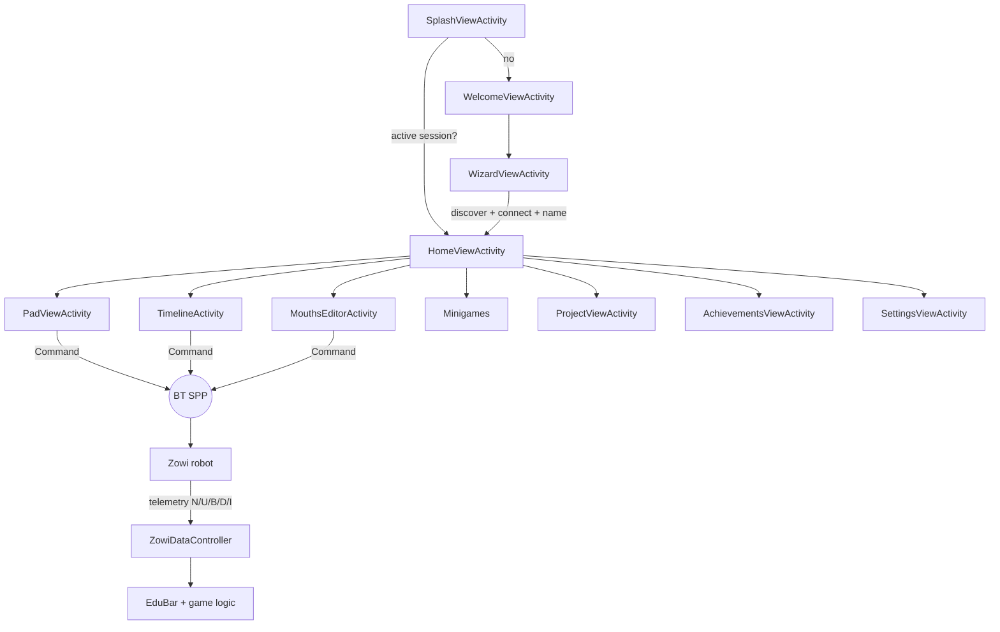
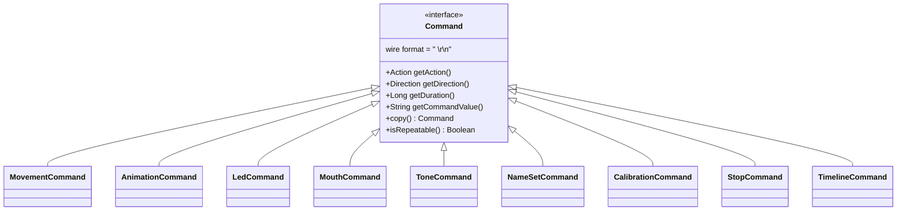
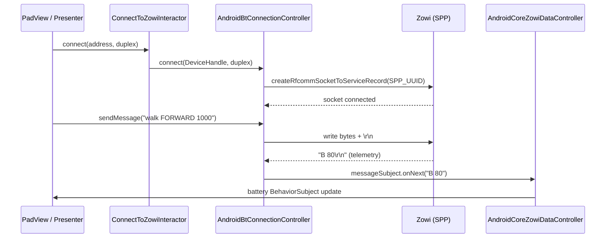
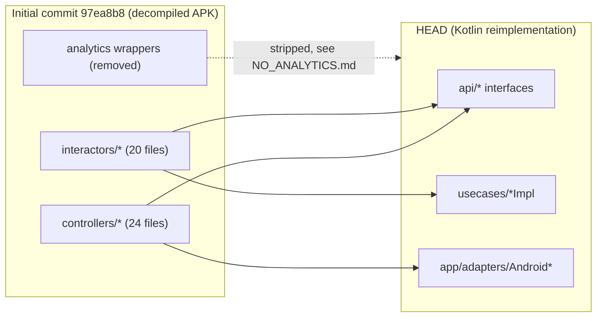

# ZowiAppReborn — Implementation & Logic Extraction

> Companion to `ARCHITECTURE.md` (layers/components) and `DESIGN.md` (visuals).
> This document extracts **all application logic**, from the highest level of abstraction down to
> concrete command/protocol details, and doubles as a **manual working-verification checklist**
> (§10). It also recovers logic from the initial decompiled commit `97ea8b8` (§9), where no code
> had yet been removed.

Conventions: `Action` ids are the lowercased enum name (e.g. `WALK` → `"walk"`). Commands are
terminated by `\r\n` (`Command.CRLN`). Robot telemetry is echoed as space-separated tokens.

---

## Table of Contents

- [1. Abstraction Level 1 — The Whole System in One Paragraph](#1-abstraction-level-1-the-whole-system-in-one-paragraph)
- [2. Abstraction Level 2 — End-to-End Happy Path](#2-abstraction-level-2-end-to-end-happy-path)
  - [2.1 End-to-End Flow Diagram](#21-end-to-end-flow-diagram)
- [3. Abstraction Level 3 — Feature Modules & Their Logic](#3-abstraction-level-3-feature-modules-their-logic)
- [4. Command & Protocol Model (`zowi-core/models/commands/`)](#4-command-protocol-model-zowi-coremodelscommands)
  - [4.1 `Action` vocabulary (`Command.Action`)](#41-action-vocabulary-commandaction)
  - [4.2 Wire formats (verified `getCommandValue()`)](#42-wire-formats-verified-getcommandvalue)
  - [4.3 Command Model Diagram](#43-command-model-diagram)
- [5. Bluetooth Connection Flow (live Rx path)](#5-bluetooth-connection-flow-live-rx-path)
  - [5.1 Telemetry parsing (`AndroidCoreZowiDataController`)](#51-telemetry-parsing-androidcorezowidatacontroller)
  - [5.2 Bluetooth Connection Sequence](#52-bluetooth-connection-sequence)
- [6. Robot Behavior Vocabulary (mapped to the robot firmware)](#6-robot-behavior-vocabulary-mapped-to-the-robot-firmware)
- [7. Achievements, Ranking, Projects, Minigames](#7-achievements-ranking-projects-minigames)
- [8. CLI (`zowi-cli`)](#8-cli-zowi-cli)
- [9. Recovered Logic from the Initial Decompiled Commit (`97ea8b8`)](#9-recovered-logic-from-the-initial-decompiled-commit-97ea8b8)
  - [9.1 `controllers/` (24 files, removed) — orchestration](#91-controllers-24-files-removed-orchestration)
  - [9.2 `interactors/` (20 files, removed) — use-cases](#92-interactors-20-files-removed-use-cases)
  - [9.3 Removed analytics wrappers (context only)](#93-removed-analytics-wrappers-context-only)
  - [9.4 Recovered-Logic Mapping Diagram](#94-recovered-logic-mapping-diagram)
- [10. Working Verification — Manual Checklist (per screen)](#10-working-verification-manual-checklist-per-screen)
  - [10.1 Splash / Welcome / Wizard](#101-splash-welcome-wizard)
  - [10.2 Home](#102-home)
  - [10.3 Pad (gamepad)](#103-pad-gamepad)
  - [10.4 Timeline](#104-timeline)
  - [10.5 Mouths Editor & Minigame](#105-mouths-editor-minigame)
  - [10.6 Minigames (ZowiSays / ZowiRunner)](#106-minigames-zowisays-zowirunner)
  - [10.7 Projects / Discover](#107-projects-discover)
  - [10.8 Achievements](#108-achievements)
  - [10.9 Settings / Calibration](#109-settings-calibration)
  - [10.10 CLI (`zowi-cli`)](#1010-cli-zowi-cli)
  - [10.11 Regression guardrails](#1011-regression-guardrails)
- [11. References](#11-references)

## 1. Abstraction Level 1 — The Whole System in One Paragraph

The app connects over **Bluetooth Classic SPP** to a Zowi robot, persists the paired robot in a
**session**, and exposes a set of **interactive experiences** (a gamepad `Pad`, a `Timeline`
visual programming editor, a `Mouths` LED editor + minigame, three `minigames`, ten `Discover`
projects with firmware flashing, and an `Achievements`/ranking system). Every user action is
translated into a `Command` object, serialized to a text string, and written to the robot; the
robot's sensor replies (name, app id, battery, distance, noise) are parsed back into the UI.
The same domain logic is reused by a headless `zowi-cli` for desktop/terminal control.

## 2. Abstraction Level 2 — End-to-End Happy Path

1. **Launch** → `SplashViewActivity` waits ~1.5 s, then asks `SessionController` if a Zowi is
   active / the wizard was dismissed. If yes → `HomeViewActivity`; else → `WelcomeViewActivity`.
2. **Onboarding** → Welcome → `WizardViewActivity` (`BTAdapterController.startBTDiscovery()` →
   `FindZowisInteractor` → user picks a device → `ConnectToZowiInteractor` → name prompt →
   `ChangeZowiNameInteractor` → `SessionController` saves address+name).
3. **Home** → hub grid of apps / games / projects; Mouths-Editor tile unlocked by achievement state.
4. **Interact** → any screen builds `Command`s and calls `SendCommandToZowiInteractor`; robot
   telemetry flows back via `ZowiDataController` into `EduBar` and game logic.
5. **Progress** → `AchievementsController` / `RankingController` / `GameController` persist unlocks
   and scores in `KeyValueStore`.

### 2.1 End-to-End Flow Diagram



## 3. Abstraction Level 3 — Feature Modules & Their Logic

| Module | Key classes | Core logic |
|---|---|---|
| Onboarding/Wizard | `WelcomeView*`, `WizardView*`, `SplashView*` | Session gating, BT discovery, connect, name. |
| Home | `HomeView*`, `HomePresenter*` | Aggregates unlock state; launches sub-experiences via wireframes. |
| Pad (gamepad) | `PadView*`, `PadPresenter*` | Maps physical buttons → `MovementCommand`/`AnimationCommand`/`LedCommand`/`ToneCommand`; achievement-gated buttons. |
| Timeline | `TimelineActivity`, `Timeline*Presenter`, `TimelineGameControllerImpl` | Drag/drop `CommandTileView`s into a sequence, serialize with Gson, play/loop, persist progress. |
| Mouths | `MouthsEditor*`, `MouthsMinigame*` | 6×5 LED matrix editing (`MouthCommand`/`GridCommand`); matching minigame. |
| Minigames | `ZowiSays*`, `ZowiRunner*`, `Mouths*` | `GameController.GAME_ID` per game; rankings + achievement unlocks. |
| Projects/Discover | `ProjectView*`, `ProjectQuizView*`, `ProjectController` | Load `assets/projects/NN_*.json`; quiz gate; flash `assets/ZOWI_*.hex` via `SendAppToZowiInteractor`. |
| Achievements | `AchievementsView*`, `AchievementsController` | Catalog from `initial_list.json`; unlock by id; gallery + ranking. |
| Settings/Calibration | `SettingsView*`, `CalibrationView*` | Rename, forget, forget-history, restore firmware, leg/feet trim calibration (`CalibrationCommand`). |
| CLI | `ZowiCli`, `Cli*` adapters | `scan/connect/send/name/battery/status/achievements/rankings/games/forget/session`. |

## 4. Command & Protocol Model (`zowi-core/models/commands/`)

`Command` (interface) exposes `getAction()`, `getDirection()`, `getDuration()`, `getCommandValue()`,
`copy()`, `isRepeatable()`, `getAllowedActions/Directions/Durations()`. Implementations:

`BaseCommand`, `MovementCommand`, `StaticCommand`, `AnimationCommand`, `StopCommand`, `FallCommand`,
`ForwardBackwardCommand`, `ForwardRunnerCommand`, `LeftRightCommand`, `LeftRightRunnerCommand`,
`MotionlessCommand`, `GridCommand`, `LedCommand`, `MouthCommand`, `ToneCommand`, `NameSetCommand`,
`CalibrationCommand`, `DataRequestCommand`, `TimelineCommand`.

### 4.1 `Action` vocabulary (`Command.Action`)
- **Movements:** `STOP, WALK, TURN, UPDOWN, MOONWALKER, SWING, CRUSAITO, JUMP, FLAPPING, TIP_TOE,
  BEND, SHAKE_LEG, JITTER, ASCENDING_TURN, FALL`
- **Animations/emotions:** `HAPPY, SUPER_HAPPY, SAD, SLEEPY, FART, CONFUSED, IN_LOVE, ANGRY,
  ANXIOUS, MAGIC, WAVE, VICTORY, GAME_OVER`
- **LED-mouth glyphs:** `MOUTH_SMILE, MOUTH_SAD, MOUTH_CONFUSED, MOUTH_BIG_SURPRISE,
  MOUTH_SMALL_SURPRISE, MOUTH_HAPPY_OPEN, MOUTH_HAPPY_CLOSED, MOUTH_SAD_OPEN, MOUTH_SAD_CLOSED,
  MOUTH_HEART, MOUTH_THUNDER, MOUTH_X, MOUTH_INTERROGATION, MOUTH_TONGUE_OUT, MOUTH_DIAGONAL,
  MOUTH_ANGRY, MOUTH_CULITO, MOUTH_OK, MOUTH_LINE, MOUTH_VAMP1, MOUTH_VAMP2, MOUTH_ZERO…MOUTH_NINE,
  MOUTH_EMPTY, MOUTH_WALRUS, MOUTH_CONCENTRATED, MOUTH_BIG_OPEN, MOUTH_TEETH`
- **Signals/config:** `LED_MOUTH, TONE, DISTANCE, NOISE, BATTERY, APP_ID, NAME, SET_NAME,
  CALIBRATE_TRIM, CALIBRATE_GRADES`

### 4.2 Wire formats (verified `getCommandValue()`)
| Command | Wire string (before `\r\n`) | Source |
|---|---|---|
| `StopCommand` | `S` | `StopCommand.kt` |
| `NameSetCommand` | `R <name>` | `NameSetCommand.kt` |
| `ToneCommand` | `T <frequency> <duration>` | `ToneCommand.kt` |
| `LedCommand` / `MouthCommand` | `<LED_MOUTH><ledMatrix>` (6×5 = 30-bit matrix) | `LedCommand.kt` / `MouthCommand.kt` |
| Movement/animation | `<action> <commandExtras>` (steps/direction/duration) | `MovementCommand` family |

`Direction`: `FORWARD, BACKWARD, LEFT, RIGHT`. Timed moves expose `getAllowedDurations()`.

### 4.3 Command Model Diagram



## 5. Bluetooth Connection Flow (live Rx path)

1. `BTAdapterController.enableBluetooth()` (Android 12+ needs `BLUETOOTH_CONNECT`/`BLUETOOTH_SCAN`).
2. `startBTDiscovery()` → `Observable<DeviceHandle>`; UI shows found Zowis.
3. `ConnectToZowiInteractor.connect(address, duplex)` → `BTConnectionController.connect(handle, duplex)`
   opens `BluetoothSocket` at `SPP_UUID` (`00001101-…-00805f9b34fb`), `sppSocket.connect()`.
4. `sendMessage(str)` writes bytes; a read thread splits incoming data on `\r\n` into
   `getReceivedMessageObservable()`. `getConnectionStatusObservable()` exposes status changes.
5. `stopConnection()` closes the socket.

### 5.1 Telemetry parsing (`AndroidCoreZowiDataController`)
Incoming line is `split(" ")`; tokens update `BehaviorSubject`s:
`N`→name, `U`→app id, `B`→battery, `D`→distance, `I`→noise. Exposed via `ZowiDataController`
`get*` / `waitFor*` `Single`s.

### 5.2 Bluetooth Connection Sequence



## 6. Robot Behavior Vocabulary (mapped to the robot firmware)

The app's `Action` set mirrors the Zowi Arduino firmware (see local doc
`/media/datos/MiDocencia/Zowi/Documentacion/ZOWI_MBLOCK_HOWTO.md` and `bq/zowiLibs`):
- **Movements** map to `walk()`, `turn()`, `bend()`, `shakeLeg()`, `jump()`, `updown()`, `swing()`,
  `tiptoeSwing()`, `jitter()`, `ascendingTurn()`, `moonwalker()`, `crusaito()`, `flapping()`.
- **Sensors** (`getDistance()`, `getNoise()`, `getBatteryLevel()`) appear as telemetry tokens.
- **Display** (`putMouth()`, `putAnimationMouth()`, `clearMouth()`) map to `MOUTH_*` glyphs.
- **Sounds** (`_tone()`, `sing()`) map to `TONE` and animation/song gestures.
- **Gestures** (`playGesture()`) map to `HAPPY/SUPER_HAPPY/SAD/CONFUSED/ANGRY/FART/MAGIC/WAVE/VICTORY`.
- **Calibration:** `CALIBRATE_TRIM` / `CALIBRATE_GRADES` trim servo offsets for an "altered" robot.

## 7. Achievements, Ranking, Projects, Minigames

- **Achievements:** catalog in `assets/achievements/initial_list.json`; `AchievementsController`
  get/unlock/list; unlocks triggered by `CheckAchievementAndUnlockItInteractor` (e.g. performing a
  movement, finishing a game). Three categories: movements, animations, games.
- **Ranking:** `RankingController` get/save per `GAME_ID`; `isScoreInTop10`; persisted in `KeyValueStore`.
- **Projects (Discover):** 10 lessons `01_project_mueve` … `10_project_gravity`
  (`assets/projects/*.json`) with description, links, quiz content, and an optional firmware `.hex`.
  `ProjectController` marks completed; quiz can be blocked/unblocked; `SendAppToZowiInteractor`
  streams the `.hex` (progress `Observable<Integer>`) flashed via STK500v1.
- **Minigames (`GameController.GAME_ID`):** `ZOWI_SAYS_GAME_ID` (Simon), `MOUTHS_GAME_ID`
  (LED draw), `TIMELINE_GAME_ID` (sequence), `GAMEPAD_GAME_ID` (free control). Each persists
  progress via `GameController.saveProgress/loadProgress` and can unlock achievements.

## 8. CLI (`zowi-cli`)

`ZowiCli` dispatches: `scan`, `connect`, `send`, `name`, `battery`, `status`, `achievements`,
`rankings`, `games`, `forget`, `session`. It implements the same `api/*` interfaces via `Cli*`
adapters (serial over `jSerialComm` or BT) and `ConsoleLogger`, proving the domain layer is
UI-independent. Tests: `Cli*Test`, `JsonKeyValueStoreTest` (JUnit + Mockito).

## 9. Recovered Logic from the Initial Decompiled Commit (`97ea8b8`)

The initial commit was the raw decompiled APK (**5,238 files / 411 dirs**) vs **2,707 / 238** today.
Most removed files were third-party blobs (Android Support Lib 568, RxJava 305, Google Play
Services/Gson/AdMob 1,090, comScore 128, Adobe Mobile 73, Bugsnag 25, Retrofit 65, IntelliJ 15).
The **application-logic layers that were stripped and are recovered here** are:

### 9.1 `controllers/` (24 files, removed) — orchestration
| Controller (interface) | Responsibility | Current equivalent |
|---|---|---|
| `BTConnectionController` | `connect(BluetoothDevice, boolean)`, `sendMessage`, `sendHexToZowi(InputStream)`, `enabledReadingIncomingData()`, connection/received observables | `api/BTConnectionController` + `AndroidBtConnectionController` |
| `BTAdapterController` | `enable/disableBluetooth`, `startBTDiscovery()`→`Observable<BluetoothDevice>` | `api/BTAdapterController` |
| `ZowiDataController` | Telemetry listeners (`OnBatteryLevelReceivedListener`, `OnDistanceLevelReceivedListener`, `OnNoiseLevelReceivedListener`, `OnZowiAppIdReceivedListener`, `OnZowiNameReceivedListener`) + `get*`/`waitFor*` `Single`s | `api/ZowiDataController` + `AndroidCoreZowiDataController` |
| `SessionController` | `resetActiveZowi`, `saveActiveZowiDeviceAddress`, `saveActiveZowiName` | `api/SessionController` |
| `GameController` | `isFirstPlay`, `loadProgress`/`saveProgress`, `resetGamesProgress`, `GAME_ID` enum | `api/GameController` |
| `AchievementsController` | `getAchievement`, `getAchievementsList`, `unlockAchievement`, `unlockAllAchievements`, `resetAchievementsList` | `api/AchievementsController` |
| `ProjectController` | `getProject`, `setProjectCompleted`, `getProjectIsCompleted`, `blockProjectQuiz`/`isProjectQuizBlocked`, `resetAllProjects` | `api/ProjectController` |
| `RankingController` | `getRanking`, `saveRankingEntry`, `isScoreInTop10`, `resetAllRankings` | `api/RankingController` |
| `AppController` | `isFirstUsage`, `getDaysOfUse`, `logAppStarted`, `resetAppLogs` | `api/AppController` |
| `AssetController` | Load bundled assets | `api/AssetController` / `AssetProvider` |
| `KitonNetworkController` (+`KitonNetworkService`) | `sendIsAliveToKiton` backend ping | `api/KitonNetworkController` |
| `ZowiBluetoothConnection`, `TimelineGameControllerImpl` | concrete BT/session + timeline-game glue | split into `adapters` + `usecases` |

### 9.2 `interactors/` (20 files, removed) — use-cases
| Interactor (interface) | Signature | Current equivalent |
|---|---|---|
| `SendCommandToZowiInteractor` | `Single<Void> sendCommandToZowi(Command)` | `usecases/SendCommandToZowiInteractor*` |
| `ConnectToZowiInteractor` | `Single<Void> connectToZowi(String, boolean)` | `usecases/ConnectToZowiInteractor*` |
| `FindZowisInteractor` | `Single<BluetoothDevice> findZowis()` | `usecases/FindZowisInteractor*` + `BTAdapterController` |
| `ChangeZowiNameInteractor` | `Single<Void> changeZowiName(String)` | `usecases/ChangeZowiNameInteractor*` |
| `MeasureZowiBatteryLevelInteractor` | battery `Single` | `usecases/MeasureZowiBatteryLevelInteractor*` |
| `ForgetZowiInteractor` | `Single<Void> forgetZowi()` | `usecases/ForgetZowiInteractor*` |
| `ForgetPlayingHistoryInteractor` | `Single<Void> forgetPlayingHistory()` | `usecases/ForgetPlayingHistoryInteractor*` |
| `SendAppToZowiInteractor` | `Observable<Integer> sendAppToZowi(String)` | `usecases/SendAppToZowiInteractor*` |
| `CheckAchievementAndUnlockItInteractor` | unlock by id | `usecases/CheckAchievementAndUnlockItInteractor*` |
| `CheckInstalledZowiAppInteractor` | detect flashed app | `usecases/CheckInstalledZowiAppInteractor*` |

> Note: in HEAD the original Java `controllers`/`interactors` are **re-implemented as Kotlin
> `api/*` interfaces + `usecases/*Impl` + `app/adapters/Android*`**. The behavior is preserved;
> the decompiled class bodies in `97ea8b8` are the historical reference if exact legacy logic is needed.

### 9.3 Removed analytics wrappers (context only)
`com/bq/analytics/*`, `com/bq/gatracker/*`, `com/bq/zowi/analytics/*` (~18 files of `Crash`,
`Ecommerce`, `Event`, `Screen`, `Social`, `UserTiming` hit models) and `ADBMobileConfig.json`.
Fully removed — see `docs/project/NO_ANALYTICS.md`. Not part of runtime logic.

---

### 9.4 Recovered-Logic Mapping Diagram



## 10. Working Verification — Manual Checklist (per screen)

Run the app with:
```bash
./run_app.sh            # build + install + launch on device/emulator
./run_emulator.sh       # launch emulator: es_ES, landscape, density 350, font 1.0
```
Use `adb logcat -s Grove` to watch domain logs. Each item is a **pass/fail** check.

### 10.1 Splash / Welcome / Wizard
- [ ] App launches to Splash; after ~1.5 s routes to Home (if a Zowi was paired before) **or** Welcome.
- [ ] Welcome → "Start Wizard" opens `WizardViewActivity`.
- [ ] Wizard discovers nearby Zowi robots and lists them (`BTAdapterController.startBTDiscovery`).
- [ ] Selecting a Zowi connects (`ConnectToZowiInteractor`); `EduBar` shows connected icon.
- [ ] Name prompt persists via `ChangeZowiNameInteractor` + `SessionController`; next launch opens Home directly.

### 10.2 Home
- [ ] Grid shows apps / games / projects tiles.
- [ ] Mouths-Editor tile reflects its unlock state correctly.
- [ ] Tapping a tile navigates to the correct screen (no blank screen — see CHANGELOG 1.9.1.6 fix).

### 10.3 Pad (gamepad)
- [ ] Movement buttons send `WALK/TURN/…` commands (watch `Grove` for the wire string).
- [ ] Animation/emotion buttons send `HAPPY/…` / `MOUTH_*` commands.
- [ ] LED and Tone buttons send `LED_MOUTH`/`TONE` commands.
- [ ] Achievement-locked buttons are disabled (greyed `blocked_pad_*`) until unlocked.
- [ ] Robot physically moves / plays sound / shows mouth in sync.

### 10.4 Timeline
- [ ] Drag a command tile into the sequence row (`CommandTileView`); reorder via drag.
- [ ] Play sends the sequence command-by-command; loop option works.
- [ ] Progress persists across sessions (`GameController.saveProgress`, `TIMELINE_GAME_ID`).
- [ ] Delete from the item context menu (`res/menu/timeline_selected_item_menu.xml`) works.

### 10.5 Mouths Editor & Minigame
- [ ] Editor renders a 6×5 LED grid; toggling cells updates `MouthCommand` matrix.
- [ ] Sending the mouth lights the robot's LED panel (`LED_MOUTH` wire format).
- [ ] Mouths minigame shows a target glyph and scores matches; ranking saved.

### 10.6 Minigames (ZowiSays / ZowiRunner)
- [ ] ZowiSays plays a Simon sequence; correct input advances, wrong input ends game.
- [ ] ZowiRunner runs the dodge loop; score updates.
- [ ] Each game saves progress + can unlock an achievement; `MakerBox` dialog appears.

### 10.7 Projects / Discover
- [ ] Opening a project (e.g. `01_project_mueve`) shows description, links, quiz content (no `true`/`false` text leaks).
- [ ] Project quiz ("Run Test") validates answers; passing marks project completed (`ProjectController.setProjectCompleted`).
- [ ] A project with firmware flashes `assets/ZOWI_*.hex` via `SendAppToZowiInteractor` (progress bar); `restore firmware` in Settings works.

### 10.8 Achievements
- [ ] Gallery lists achievements from `initial_list.json`; unlocked vs locked states correct.
- [ ] Performing the triggering action unlocks the achievement + shows `MakerBox` success dialog.
- [ ] Ranking list shows top-10 entries per game.

### 10.9 Settings / Calibration
- [ ] Rename updates robot name + `SessionController`.
- [ ] "Forget Zowi" clears session; app returns to Welcome on next launch.
- [ ] "Forget playing history" clears achievements/rankings (`ForgetPlayingHistoryInteractor`).
- [ ] Calibration adjusts leg/feet trim (`CALIBRATE_TRIM`/`CALIBRATE_GRADES`) and persists.

### 10.10 CLI (`zowi-cli`)
```bash
./gradlew :zowi-cli:run --args="scan"
./gradlew :zowi-cli:run --args="connect <address>"
./gradlew :zowi-cli:run --args="send walk FORWARD 1000"
./gradlew :zowi-cli:run --args="battery"
./gradlew :zowi-cli:run --args="achievements"
```
- [ ] `scan` lists devices; `connect` opens the serial/BT link.
- [ ] `send` transmits a command and the robot reacts.
- [ ] `battery`/`status`/`achievements`/`rankings` return parsed domain data (proves UI-independent logic).

### 10.11 Regression guardrails
- [ ] On Android 12+, BT works with `BLUETOOTH_SCAN`/`BLUETOOTH_CONNECT` granted (see
  `docs/project/bluetooth-regression-checklist.md`).
- [ ] No NPE on "Launch Wizard" from status bar and no back-stack duplication when navigating
  Home from Pad/Mouths (CHANGELOG 1.9.2.1 fixes).

## 11. References
- `ARCHITECTURE.md` (layers/components), `DESIGN.md` (visuals).
- Local robot docs: `/media/datos/MiDocencia/Zowi/Documentacion/ZOWI_MBLOCK_HOWTO.md`,
  `/media/datos/MiDocencia/Zowi/zowi.bq.com/*` (Discover project write-ups).
- `docs/project/*`: `VIEWS.md`, `NO_ANALYTICS.md`, `MIGRATING.md`, `bluetooth-regression-checklist.md`,
  `ACHIEVEMENTS.md`, `ZOWI_CLI_ANDROID_HOWTO.md`, `ZOWI_ROBOTICS.md`, `PLANNING.md`.
- Robot firmware reference: `bq/zowiLibs`, `node-zowi`.
